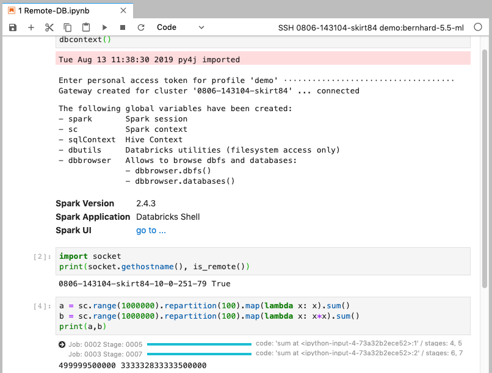

# Local JupyterLab connecting to Databricks via SSH

This package allows to connect to a remote Databricks cluster from a locally running Jupyter Lab:

## 1 Prerequisites

1. **Operating System**

    Either Macos or Linux. Windows is currently not supported

2. **Anaconda installation**
    
    A recent version of [Anaconda](https://www.anaconda.com/distribution) with Python >= *3.5*
    The tool *conda* must be newer then *4.7.5*

3. **Databricks CLI**

    To install Databricks CLI and configure profile(s) for your cluster(s), please refer to [AWS](https://docs.databricks.com/user-guide/dev-tools/databricks-cli.html) / [Azure](https://docs.azuredatabricks.net/user-guide/dev-tools/databricks-cli.html)

    Whenever `$PROFILE` is used in this documentation, it refers to a valid Databricks CLI profile name, stored in a shell environment variable.

4. **SSH access to the Databricks cluster**

    Configure your Databricks clusters to allow ssh access, see [Configure SSH access](docs/ssh-configurations.md)

    **Only clusters with valid ssh configuration are visible to *databrickslabs_jupyterlab*.** 

## 2 Installation

- Create a new conda environment and install *databrickslabs_jupyterlab* with the following commands:

    ```bash
    (base)$ conda create -n db-jlab python=3.6
    (base)$ conda activate db-jlab
    (db-jlab)$ pip install --upgrade databrickslabs-jupyterlab==1.0.2-rc6
    ```

    The prefix `(db-jlab)$` for all command examples in this document assumes that the *databrickslabs_jupyterlab* conda enviromnent `db-jlab` is activated.

- Bootstrap the environment for *databrickslabs_jupyterlab* with the following command:

    ```bash
    (db-jlab)$ databrickslabs-jupyterlab -b
    ```

    It finishes with an overview of the usage.

    

## 3 Usage

Ensure, ssh access is correctly configured, see [Configure SSH access](docs/ssh-configurations.md)

### 3.1 Starting Jupyter Lab

- Create a jupyter kernel specification for a *Databricks CLI* profile `$PROFILE` and start Jupyter Lab with the following command:

    ```bash
    (db-jlab)$ databrickslabs-jupyterlab $PROFILE -l
    ```

Notes:

- The command with `-l` is a shortcut for 

    ```bash
    (db-jlab)$ databrickslabs-jupyterlab $PROFILE -k
    (db-jlab)$ jupyter lab
    ```
    
    that ensures that the kernel specificiation is updated (one could omit the first step if the kernel specification is up to date)
- A new kernel is available in the kernel change menu (see [here](docs/kernel-name.md) for an explanation of the kernel name structure)

### 3.2 Using Spark in the Notebook

#### Getting a remote Spark Session in the notebook

When the cluster is already running the status bar of Jupyter lab should show


To connect to the remote Spark context, enter the following two lines into a notebook cell:

```python
[1] from databrickslabs_jupyterlab.connect import dbcontext
    dbcontext()
```

This will request you to add the token copied to clipboard above:

```text
    Fri Aug  9 09:58:04 2019 py4j imported
    Enter personal access token for profile 'demo' |_____________________________|
```

After pressing *Enter*, you will see

```text
    Gateway created for cluster '0806-143104-skirt84' ... connected
    The following global variables have been created:
    - spark       Spark session
    - sc          Spark context
    - sqlContext  Hive Context
    - dbutils     Databricks utilities
```



**Note:** `databrickslabs-jupyterlab $PROFILE -c` let's you quickly copy the token to the clipboard so that you can simply paste the token to the input box.

#### Switching kernels

Kernels can be switched via the Jupyterlab Kernel Change dialog. However, when switching to a remote kernel, the local connection context might get out of sync and the notebook cannot be used. In this case:

1. shutdown the kernel
2. Select the remote kernel again from the Jupyterlab Kernel Change dialog. 

A simple Kernel Restart by Jupyter lab will not work since this does not refresh the connection context!

#### Restart after cluster auto-termination

Should the cluster auto terminate while the notebook is connected or the network connection is down, the status bar will change to

- 

Additionally a dialog to confirm that the remote cluster should be started again will be launched in Jupyter Lab 

Notes: 

- One can check connectivity before, e.g. by calling `ssh <cluster_id>` in a terminal window)
- After cancelling the dialog, clicking on the status bar entry as indicated by the message will open the dialog box again

During restart the following status messages will be shown in this order:

- 
- 
- 
- 
- 

After successful start the status would again show:

- 


## 4) Advanced topics

- [Creating a mirror of a remote Databricks cluster](docs/mirrored-environment.md)
- [Detailed databrickslabs_jupyterlab command overview](docs/details.md)
- [How it works](docs/how-it-works.md)

## 4 Test notebooks

To work with the test notebooks in `./examples` the remote cluster needs to have the following libraries installed:

- mlflow==1.0.0
- spark-sklearn
