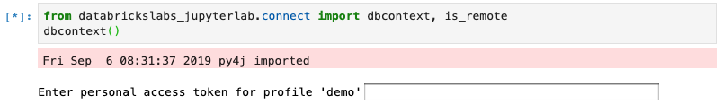
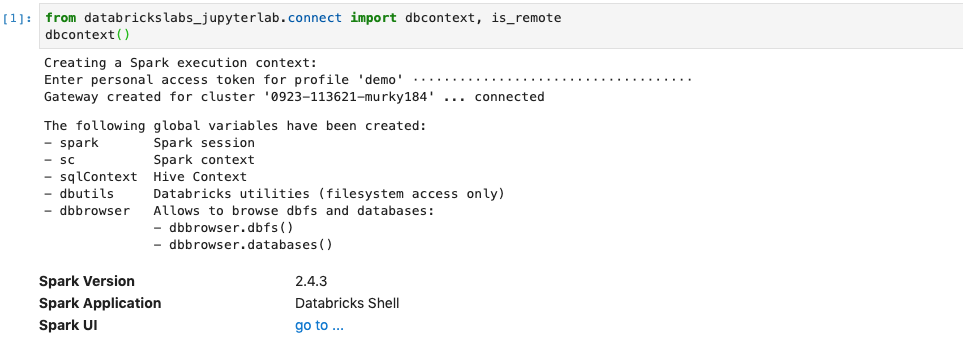

# Local JupyterLab connecting to Databricks via SSH

This package allows to connect to a remote Databricks cluster from a locally running Jupyter Lab:

## 1 Prerequisites

1. **Operating System**

    Either Macos or Linux. Windows is currently not supported

2. **Anaconda installation**

    A recent version of [Anaconda](https://www.anaconda.com/distribution) with Python >= *3.5*
    The tool *conda* must be newer then *4.7.5*

3. **Databricks CLI**

    To install Databricks CLI and configure profile(s) for your cluster(s), please refer to [AWS](https://docs.databricks.com/user-guide/dev-tools/databricks-cli.html) / [Azure](https://docs.azuredatabricks.net/user-guide/dev-tools/databricks-cli.html)

    Whenever `$PROFILE` is used in this documentation, it refers to a valid Databricks CLI profile name, stored in a shell environment variable.

4. **SSH access to the Databricks cluster**

    Configure your Databricks clusters to allow ssh access, see [Configure SSH access](docs/ssh-configurations.md)

    *Only clusters with valid ssh configuration are visible to *databrickslabs_jupyterlab*.*

5. **Databricks Runtime**

    The project has been tested with Databricks runtimes 5.5 only.

## 2 Installation

1. **Install databrickslabs_jupyterlab**
    Create a new conda environment and install *databrickslabs_jupyterlab* with the following commands:

    ```bash
    (base)$ conda create -n db-jlab python=3.6
    (base)$ conda activate db-jlab
    (db-jlab)$ pip install --upgrade databrickslabs-jupyterlab==1.0.5
    ```

    The prefix `(db-jlab)$` for all command examples in this document assumes that the *databrickslabs_jupyterlab* conda enviromnent `db-jlab` is activated.

2. **Bootstrap databrickslabs_jupyterlab**
    Bootstrap the environment for *databrickslabs_jupyterlab* with the following command, which will finish with showing the usage:

    ```bash
    (db-jlab)$ databrickslabs-jupyterlab -b
    ```

## 3 Getting started

Ensure, ssh access is correctly configured, see [Configure SSH access](docs/ssh-configurations.md)

### 3.1 Starting Jupyter Lab

1. **Create a kernel specification**
    In the terminal, create a jupyter kernel specification for a *Databricks CLI* profile `$PROFILE` and start Jupyter Lab with the following command:

    ```bash
    (db-jlab)$ databrickslabs-jupyterlab $PROFILE -k
    ```

2. **Start Jupyter Lab**
    Start Jupyter Lab using *databrickslabs-jupyterlab*

    ```bash
    (db-jlab)$ databrickslabs-jupyterlab $PROFILE -l -c
    ```

    The command with `-l` is a save version for the standard command to start Jupyter Lab (`jupyter lab`) that ensures that the kernel specificiation is updated. If `-c` is provided it also copies the PAT to the clipboard for the next step in the notebook.

    A new kernel is available in the kernel change menu (see [here](docs/kernel-name.md) for an explanation of the kernel name structure)

### 3.2 Using Spark in the Notebook

1. **Check whether the notebook is properly connected**

    When the notebook successfully connected to the cluster, the status bar at the bottom of Jupyter lab should show `...|Idle  [Connected]`:

    

    If this is not the case, see [Troubleshooting](docs/troubleshooting.md)

2. **Get a remote Spark Session in the notebook**

    To connect to the remote Spark context, enter the following two lines into a notebook cell:

    ```python
    from databrickslabs_jupyterlab.connect import dbcontext
    dbcontext()
    ```

    This will request you to add the token copied to clipboard above:

    

    After pressing *Enter*, you will see

    

    Note: `databrickslabs-jupyterlab $PROFILE -c` let's you quickly copy the token again to the clipboard so that you can simply paste the token to the input box.

3. **Test the Spark access**

    To check the remote Spark connection, enter the following lines into a notebook cell:

    ```python
    import socket
    print(socket.gethostname(), is_remote())

    a = sc.range(10000).repartition(100).map(lambda x: x).sum()
    print(a)
    ```

    It will show that the kernel is actually running remotely and the hostname of the driver. The second part quickly smoke tests a Spark job.

    

**Success:** Your local Jupyter Lab is successfully contected to the remote Databricks cluster

## 4 Advanced topics

- [Switching kernels and restart after cluster auto-termination](docs/kernel_lifecycle.md)
- [Creating a mirror of a remote Databricks cluster](docs/mirrored-environment.md)
- [Detailed databrickslabs_jupyterlab command overview](docs/details.md)
- [How it works](docs/how-it-works.md)
- [Troubleshooting](docs/troubleshooting.md)

## 5 Project Support
Please note that all projects in the /databrickslabs github account are provided for your exploration only, and are not formally supported by Databricks with Service Level Agreements (SLAs). They are provided AS-IS and we do not make any guarantees of any kind. Please do not submit a support ticket relating to any issues arising from the use of these projects.

Any issues discovered through the use of this project should be filed as GitHub Issues on the Repo. They will be reviewed as time permits, but there are no formal SLAs for support.

## 6 Test notebooks

To work with the test notebooks in `./examples` the remote cluster needs to have the following libraries installed:

- mlflow==1.0.0
- spark-sklearn
