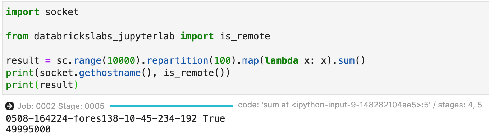

# Local JupyterLab connecting to Databricks via SSH

This package allows to connect to a remote Databricks cluster from a locally running JupyterLab.

## >>> New minor release V2.1 (Jan 2021) <<<

## 1 New features

- A new parser for ssh/config that aims for minimum changes (including whitespaces and comments). For verification it shows the diff view to the original version:
    ```text
        Host 0102-115241-craws1
    -     HostName ec2-11-22-33-44.eu-central-1.compute.amazonaws.com
    +     HostName 111.222.333.444
        User ubuntu
    -     Port 2200
    ?            ^^

    +     Port 2222
    ?            ^^

        IdentityFile ~/.ssh/id_aws-ffm
        ServerAliveInterval 30
        ConnectTimeout 5
        ServerAliveCountMax 5760
    ```
- SSH tunnels are now supported by setting the environment variable SSH_TUNNEL to `address:port` of the tunnel service. See above where a standard AWS Databricks hostname and port (`ec2-11-22-33-44.eu-central-1.compute.amazonaws.com`, `2200`) got replaced by a SSH tunnel at `111.222.333.444` and port `2222`. 
For the ssh tunnel one can use a managed service like [ngrok](https://ngrok.com/). 
Alternatively, build your own tunneling service based on e.g. [Fast Reverse Proxy (fpr)](https://github.com/fatedier/frp) as described in .
In both cases, one will use it as 

    ```bash
    export SSH_TUNNEL=52.52.52.52:2222
    dj <profile> -k
    ```

- Support of Databricks Runtimes 6.4, 7.3 and 7.5 (standard and ML)

- A new flag "--env" allows to add extra environment variables available in the notebooks

- Many bug fixes

## 2 Overview


## 3 Prerequisites

1. **Operating System**

    *Jupyterlab Integration* will run on the following operation systems:

    - macOS
    - Linux
    - Windows 10 (with OpenSSH)

2. **Anaconda**

    *JupyterLab Integration* is based on [Anaconda](https://www.anaconda.com/distribution) and supports:

    - A recent version of Anaconda with Python >= *3.8*
    - The tool *conda* must be newer than *4.7.5*, test were executed with *4.9.2*.

    Since *Jupyterlab Integration* will create a separate conda environment, [Miniconda](https://docs.conda.io/en/latest/miniconda.html) is sufficient to start

3. **Python**

    *JupyterLab Integration* only works with Python 3 and supports Python 3.7 and Python 3.8 both on the remote cluster and locally.

4. **Databricks CLI**

    For *JupyterLab Integration* a recent version of *Databricks CLI* is needed. To install *Databricks CLI* and to configure profiles for your clusters, please refer to [AWS](https://docs.databricks.com/user-guide/dev-tools/databricks-cli.html) / [Azure](https://docs.azuredatabricks.net/user-guide/dev-tools/databricks-cli.html).

    Note: 

    - *JupyterLab Integration* does not support Databricks CLI profiles with username password. Only [Personal Access Tokens](https://docs.databricks.com/dev-tools/api/latest/authentication.html) are supported.
    - Whenever `$PROFILE` is used in this documentation, it refers to a valid Databricks CLI profile name, stored in a shell environment variable.

5. **SSH access to Databricks clusters**

    Configure your Databricks clusters to allow ssh access, see [Configure SSH access](docs/ssh-configurations.md)

    Note: 

    - *Only clusters with valid ssh configuration are visible to* `databrickslabs_jupyterlab`.

6. **Databricks Runtime**

    *JupyterLab Integration* has been tested with the following Databricks runtimes on AWS and Azure:

    - *'6.4'* and *'6.4 ML'*
    - *'7.3'* and *'7.3 ML'*
    - *'7.5'* and *'7.5 ML'*

    Newer runtimes might work, however are subject to own tests.

## 4 Running with docker

A docker image ready for working with *Jupyterlab Integration* is available from Dockerhub. It is recommended to prepare your environment by pulling the repository: `docker pull bwalter42/databrickslabs_jupyterlab:2.1.0-rc2`

There are two scripts in the folder `docker`:

- for Windows: `dk.dj.bat` and `dk-jupyter.bat`
- for macOS/Linux: `dk-dj` and `dk-jupyter`

Alternatively, under macOS and Linux one can use the following bash functions:

- *databrickslabs-jupyterlab* for docker:

    This is the *Jupyterlab Integration* configuration utility using the docker image:

    ```bash
    function dk-dj {
        docker run -it --rm -p 8888:8888 \
            -v $(pwd)/kernels:/home/dbuser/.local/share/jupyter/kernels/ \
            -v $HOME/.ssh/:/home/dbuser/.ssh  \
            -v $HOME/.databrickscfg:/home/dbuser/.databrickscfg \
            -v $(pwd):/home/dbuser/notebooks \
            bwalter42/databrickslabs_jupyterlab:2.1.0-rc2 /opt/conda/bin/databrickslabs-jupyterlab $@
    }
    ```

- *jupyter* for docker:

    Allows to run *jupyter* commands using the docker image:

    ```bash
    function dk-jupyter {
        docker run -it --rm -p 8888:8888 \
            -v $(pwd)/kernels:/home/dbuser/.local/share/jupyter/kernels/ \
            -v $HOME/.ssh/:/home/dbuser/.ssh  \
            -v $HOME/.databrickscfg:/home/dbuser/.databrickscfg \
            -v $(pwd):/home/dbuser/notebooks \
            bwalter42/databrickslabs_jupyterlab:2.1.0-rc2 /opt/conda/bin/jupyter $@
    }
    ```

The two scripts assume that notebooks will be in the current folder and kernels will be in the `kernels` subfolder of the current folder:

```text
$PWD  <= Start jupyterLab from here
 |_ kernels
 |  |_ <Jupyterlab Integration kernel spec>
 |  |_ ... 
 |_ project
 |  |_ notebook.ipynb
 |_ notebook.ipynb
 |_ ...
```

**Note, the scripts `dk-dj` / `dk-dj.bat` will modify your `~/.ssh/config` and `~/.ssh/know_hosts`!**
If you you do not want this to happen, you can for example extend the folder structure to

```text
$PWD  <= Start jupyterLab from here
|_ .ssh                      <= new
|  |_ config                 <= new
|  |_ id_$PROFILE            <= new
|  |_ id_$PROFILE.pub        <= new
|_ kernels
|  |_ <Jupyterlab Integration kernel spec>
|  |_ ... 
|_ project
|  |_ notebook.ipynb
|_ notebook.ipynb
|_ ...
```

and create the necessary public/private key pair in `$(pwd)/.ssh` and change the parameter 
`-v $HOME/.ssh/:/home/dbuser/.ssh` to `-v $(pwd)/.ssh/:/home/dbuser/.ssh` 
in both commands.

## 5 Local installation

1. **Install *Jupyterlab Integration***

    Create a new conda environment and install *databrickslabs_jupyterlab* with the following commands:

    ```bash
    (base)$ conda create -n db-jlab21 python=3.8
    (base)$ conda activate db-jlab21
    (db-jlab)$ pip install --upgrade databrickslabs-jupyterlab==2.1.0-rc2
    ```

    The prefix `(db-jlab)$` for all command examples in this document assumes that the conda enviromnent `db-jlab` is activated.

2. **The tool *databrickslabs-jupyterlab / dj***

    It comes with a batch file `dj.bat` for Windows. On MacOS or Linux both `dj` and `databrickslabs-jupyterlab` exist

3. **Bootstrap *Jupyterlab Integration***

    Bootstrap the environment for *Jupyterlab Integration* with the following command (which will show the usage after successfully configuring *Juypterlab Integration*):

    ```bash
    (db-jlab)$ dj -b
    ```

## 6 Getting started with local installation or docker

Ensure, ssh access is correctly configured, see [Configure SSH access](docs/ssh-configurations.md)

### 6.1 Starting JupyterLab

1. **Create a kernel specification**

    In the terminal, create a jupyter kernel specification for a *Databricks CLI* profile `$PROFILE` with the following command:

    - Local installation

        ```bash
        (db-jlab)$ dj $PROFILE -k
        ```

    - With docker

        ```bash
        (db-jlab)$ dk-dj $PROFILE -k
        ```

    A new kernel is available in the kernel change menu (see [here](docs/v2/kernel-name.md) for an explanation of the kernel name structure)

2. **Start JupyterLab**

    - Local installation

        ```bash
        (db-jlab)$ dj $PROFILE -l      # or 'jupyter lab'
        ```

    - With docker

        ```bash
        (db-jlab)$ dk-dj $PROFILE -l   # or 'dk-jupyter lab'
        ```

    The command with `-l` is a safe version for the standard command to start JupyterLab (`jupyter lab`) that ensures that the kernel specificiation is updated.

### 6.2 Using Spark in the Notebook

1. **Check whether the notebook is properly connected**

    When the notebook connected successfully to the cluster, the status bar at the bottom of JupyterLab should show 

    

    if you use a kernel with *Spark*, else just

    

    If this is not the case, see [Troubleshooting](docs/v2/troubleshooting.md)

2. **Test the Spark access**

    To check the remote Spark connection, enter the following lines into a notebook cell:

    ```python
    import socket

    from databrickslabs_jupyterlab import is_remote

    result = sc.range(10000).repartition(100).map(lambda x: x).sum()
    print(socket.gethostname(), is_remote())
    print(result)
    ```

    It will show that the kernel is actually running remotely and the hostname of the driver. The second part quickly smoke tests a Spark job.

     

**Success:** Your local JupyterLab is successfully contected to the remote Databricks cluster

## 7 Advanced topics

[7.1 Switching kernels and restart after cluster auto-termination](docs/v2/kernel_lifecycle.md)

[7.2 Creating a mirror of a remote Databricks cluster](docs/v2/mirrored-environment.md)

[7.3 Detailed databrickslabs_jupyterlab command overview](docs/v2/details.md)

[7.4 How it works](docs/v2/how-it-works.md)

[7.5 Troubleshooting](docs/v2/troubleshooting.md)


## 8 Project Support
Please note that all projects in the /databrickslabs github account are provided for your exploration only, and are not formally supported by Databricks with Service Level Agreements (SLAs). They are provided AS-IS and we do not make any guarantees of any kind. Please do not submit a support ticket relating to any issues arising from the use of these projects.

Any issues discovered through the use of this project should be filed as GitHub Issues on the Repo. They will be reviewed as time permits, but there are no formal SLAs for support.

## 9 Test notebooks

To work with the test notebooks in `./examples` the remote cluster needs to have the following libraries installed:

- mlflow==1.x
- spark-sklearn
