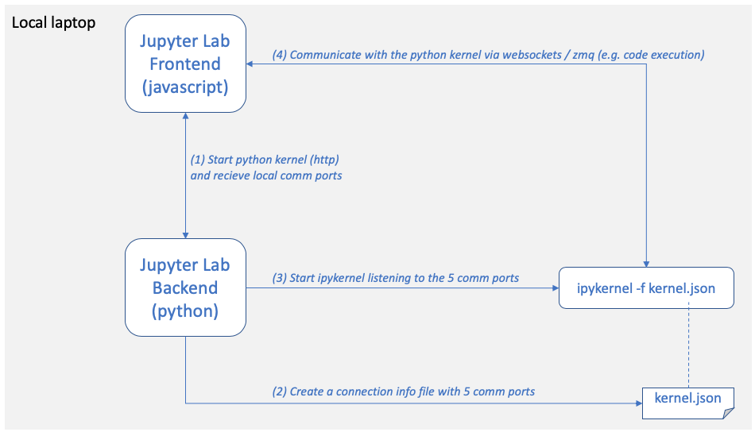
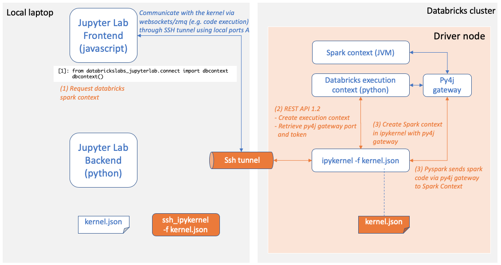

[< back](../README.md)

## How it works

To understand how databrickslabs_jupyterlab works, let's fist look at how Standard Jupyter kernels get started

Databrickslabs_jupyterlab intercepts step 3, creates two sets of communication ports and forwards the local ports to the remote machine. The orange boxes and arrows are *databrickslabs_jupyterlab* specific, the others are standard actions and components

On the remote machine, the call `dbcontext()` creates a Databricks execution context and connects via this context to the Spark Context

Finally, since there is a network connection between Jupyter and the kernel and since clusters can auto terminte, the local ssh tunnel gets monitored and the result transferred to Juyopter frontend

