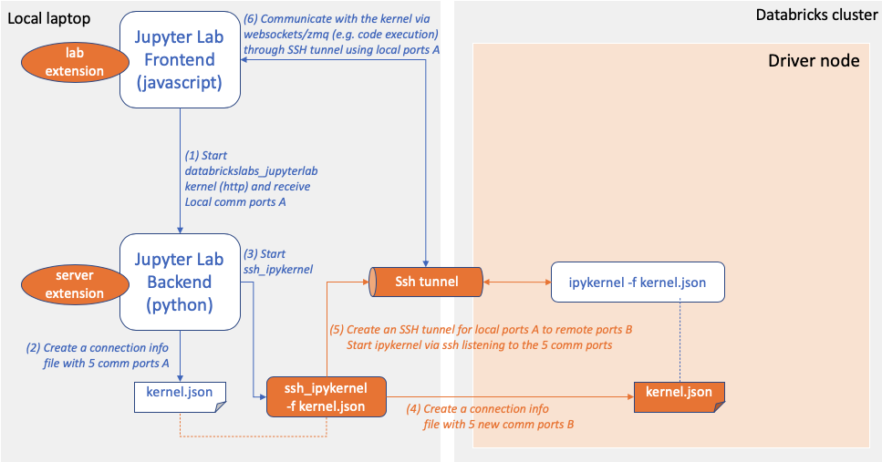
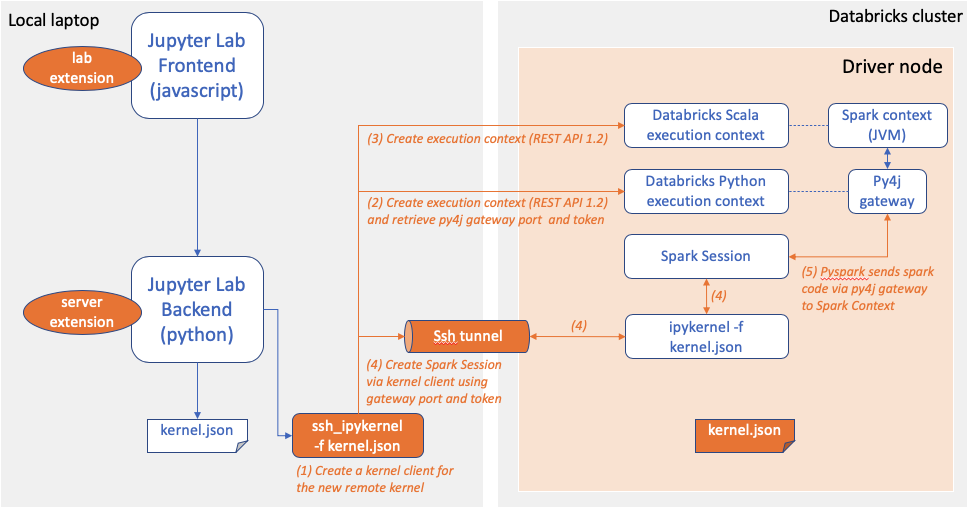
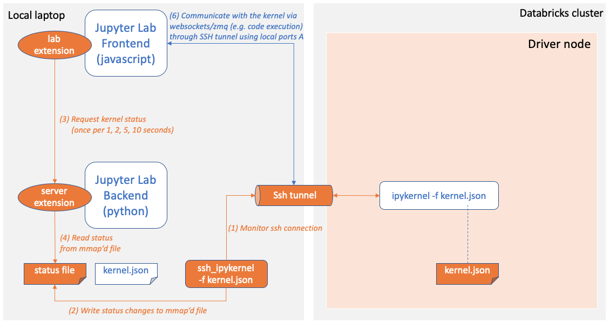

## 7.4 How it works

To understand how databrickslabs_jupyterlab works, let's fist look at how Standard Jupyter kernels get started

*JupyterLab Integration* intercepts step 3, creates two sets of communication ports and forwards the local ports to the remote machine. The orange boxes and arrows are *databrickslabs_jupyterlab* specific, the others are standard actions and components

While starting the kernel, the kernel manager will create execution contexts for Python and Scala via REST API and use an own kernel client to create the Spark Session through the secure SSH tunnels:

Finally, since there is a network connection between Jupyter and the kernel and since clusters can auto terminate, the local ssh tunnel gets monitored and the result transferred to Juypter frontend

