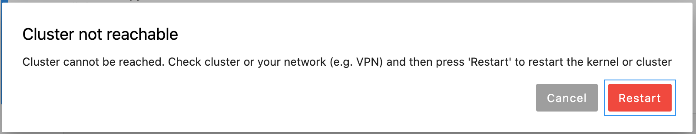
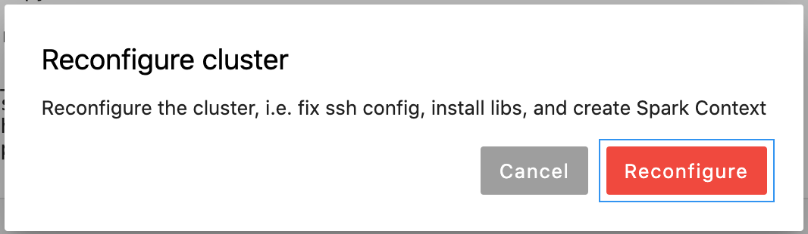

## 7.1 Kernel Lifecycle

### 7.1.1 Switching kernels

Kernels can be switched via the Jupyterlab Kernel Change dialog. However, when switching to a remote kernel, the local connection context might get out of sync and the notebook cannot be used. In this case:

1. Shutdown the kernel
2. Select the remote kernel again from the Jupyterlab Kernel Change dialog. 

A simple Kernel Restart by Jupyter lab will not work since this does not refresh the connection context!

### 7.1.2 Restart after cluster auto-termination

Should the cluster auto terminate while the notebook is connected or the network connection is down, the status bar will change to

Additionally a dialog to confirm that the remote cluster should be started again will be launched in JupyterLab:

Notes: 

- One can check connectivity before, e.g. by calling `ssh <cluster_id>` in a terminal window)
- After cancelling the dialog, clicking on the status bar entry as indicated by the message will open the dialog box again.

During restart the following status messages will be shown in this order:

- Starting 

    

- Starting

    

- Configuring SSH

    

- Installing cluster libraries

    

- Installing driver libraries

    

- Successfully connected to kernel

    

- Successfully running

    

- Successfully running with Spark

    

### 7.1.3 Reconfiguring the cluster

If the cluster was restarted and the frontend did not recognize the restart, Clicking on the `[Running]` or `[Running(Spark)]` entry in the status bar of JupyterLab will raise the following dialog box:

This will repeat the steps

- Configuring SSH

    

- Installing driver libraries

    
