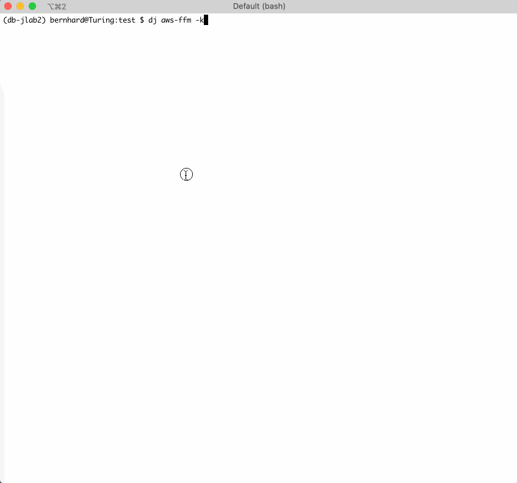

## Create JupyterLab Integration kernel specification

While starting the kernel, the kernel manager will use an own kernel client and create the Spark Session and other artifacts via REST API and the secure SSH tunnels.

