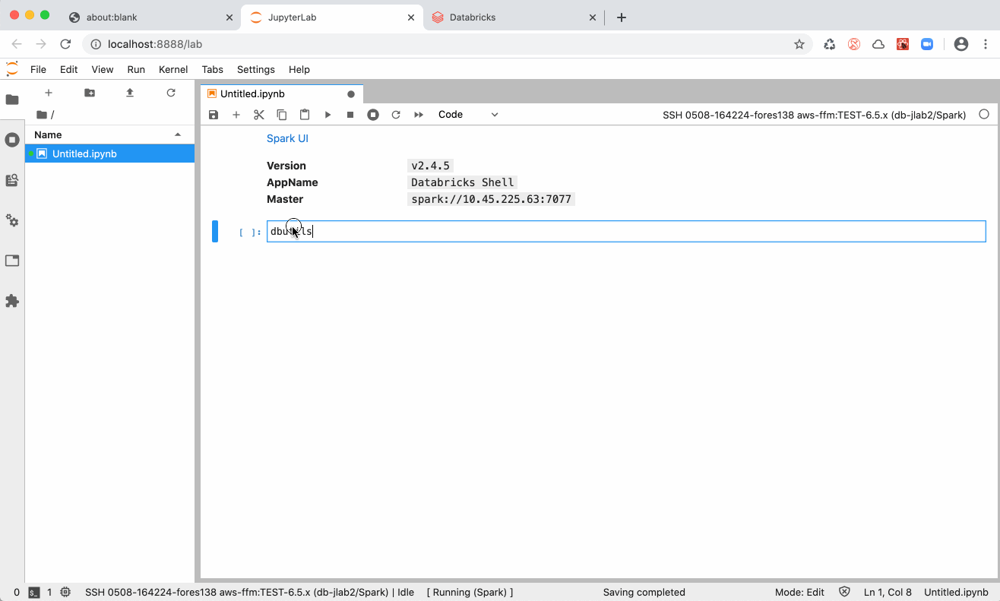

## Use Databricks dbutils.secrets in JupyterLab Integration

Databricks `dbutils.secrets` is now supported in *JupyterLab Integration* and allows to hide credentials in your code.

Note: Different to Databricks notebooks, it does not support redaction of secrets. Results of `dbutils.secrets.get` should never be printed!

