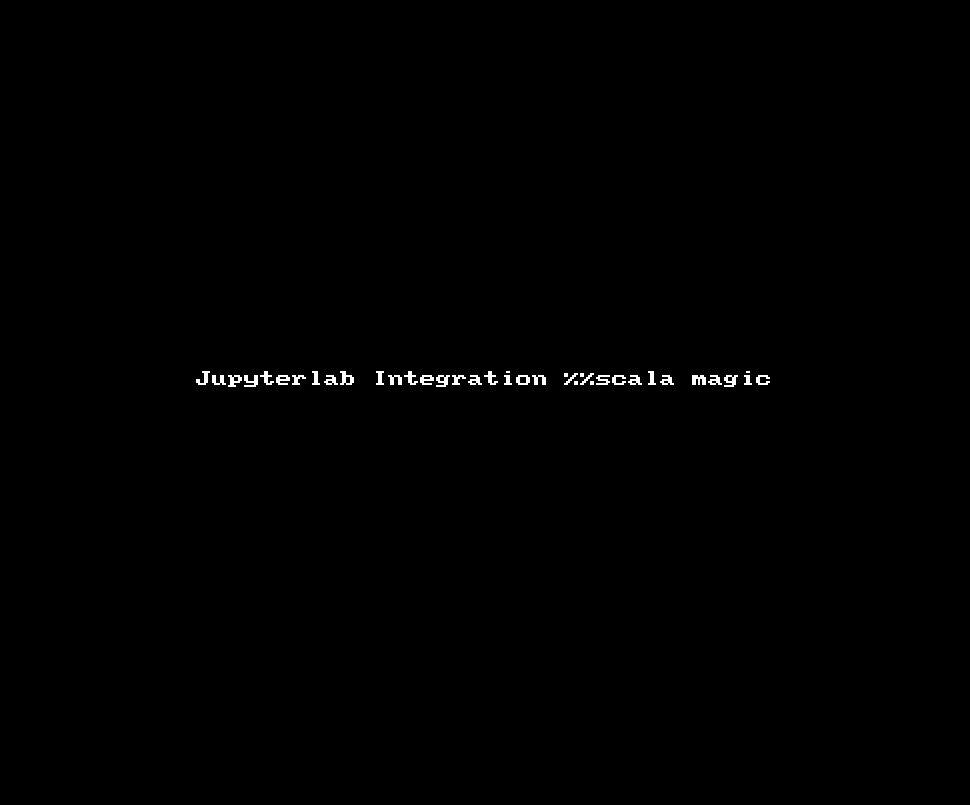

## JupyterLab Integration supports a simple Scala integration

Note:
- This is a experimental feature
- Every JupyterLab Integration notebook starts 2 executions contexts (one for python, one for Scala)
- No Spark progressbar
- No Scala autocompletion

